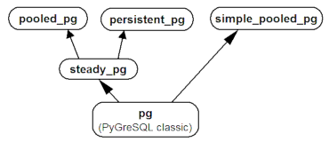
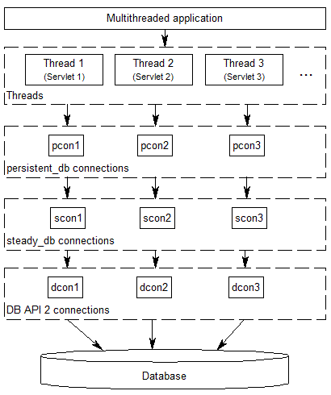

DBUtils User's Guide
++++++++++++++++++++

:Version: 3.1.2
:Translations: English | German_

.. _German: main.de.html

.. contents:: Contents

Synopsis
========

DBUtils_ is a suite of Python modules allowing to connect in a safe and
efficient way between a threaded Python_ application and a database.

DBUtils has been originally written particularly for `Webware for Python`_ as
the application and PyGreSQL_ as the adapter to a PostgreSQL_ database, but it
can meanwhile be used for any other Python application and `DB-API 2`_
conformant database adapter.

Modules
=======

The DBUtils suite is realized as a Python package containing
two subsets of modules, one for use with arbitrary DB-API 2 modules,
the other one for use with the classic PyGreSQL module.

+------------------+------------------------------------------+
| Universal DB-API 2 variant                                  |
+==================+==========================================+
| steady_db        | Hardened DB-API 2 connections            |
+------------------+------------------------------------------+
| pooled_db        | Pooling for DB-API 2 connections         |
+------------------+------------------------------------------+
| persistent_db    | Persistent DB-API 2 connections          |
+------------------+------------------------------------------+
| simple_pooled_db | Simple pooling for DB-API 2              |
+------------------+------------------------------------------+

+------------------+------------------------------------------+
| Classic PyGreSQL variant                                    |
+==================+==========================================+
| steady_pg        | Hardened classic PyGreSQL connections    |
+------------------+------------------------------------------+
| pooled_pg        | Pooling for classic PyGreSQL connections |
+------------------+------------------------------------------+
| persistent_pg    | Persistent classic PyGreSQL connections  |
+------------------+------------------------------------------+
| simple_pooled_pg | Simple pooling for classic PyGreSQL      |
+------------------+------------------------------------------+

The dependencies of the modules in the universal DB-API 2 variant
are as indicated in the following diagram:

.. image:: dependencies_db.png

The dependencies of the modules in the classic PyGreSQL variant
are similar:

Download
========

You can download the actual version of DBUtils from
the Python Package Index at::

  https://pypi.python.org/pypi/DBUtils

The source code repository can be found here on GitHub::

  https://github.com/WebwareForPython/DBUtils

Installation
============

Installation
------------
The package can be installed in the usual way::

  python setup.py install

It is even easier to download and install the package in one go using `pip`_::

  pip install DBUtils

.. _pip: https://pip.pypa.io/

Requirements
============

DBUtils supports Python_ versions 3.7 to 3.13.

The modules in the classic PyGreSQL variant need PyGreSQL_ version 4.0
or above, while the modules in the universal DB-API 2 variant run with
any Python `DB-API 2`_ compliant database interface module.

Functionality
=============

This section will refer to the names in the DB-API 2 variant only,
but the same applies to the classic PyGreSQL variant.

DBUtils installs itself as a package ``dbutils`` containing all the modules
that are described in this guide. Each of these modules contains essentially
one class with an analogous name that provides the corresponding functionality.
For instance, the module ``dbutils.pooled_db`` contains the class ``PooledDB``.

SimplePooledDB (simple_pooled_db)
---------------------------------
The class ``SimplePooledDB`` in ``dbutils.simple_pooled_db`` is a very basic
reference implementation of a pooled database connection. It is much less
sophisticated than the regular ``pooled_db`` module and is particularly lacking
the failover functionality. ``dbutils.simple_pooled_db`` is essentially the
same as the ``MiscUtils.DBPool`` module that is part of Webware for Python.
You should consider it a demonstration of concept rather than something
that should go into production.

SteadyDBConnection (steady_db)
------------------------------
The class ``SteadyDBConnection`` in the module ``dbutils.steady_db`` implements
"hardened" connections to a database, based on ordinary connections made by any
DB-API 2 database module. A "hardened" connection will transparently reopen
upon access when it has been closed or the database connection has been lost
or when it is used more often than an optional usage limit.

A typical example where this is needed is when the database has been
restarted while your application is still running and has open connections
to the database, or when your application accesses a remote database in
a network that is separated by a firewall and the firewall has been
restarted and lost its state.

Usually, you will not use the ``steady_db`` module directly; it merely serves
as a basis for the next two modules, ``persistent_db`` and ``Pooled_db``.

PersistentDB (persistent_db)
----------------------------
The class ``PersistentDB`` in the module ``dbutils.persistent_db`` implements
steady, thread-affine, persistent connections to a database, using any DB-API 2
database module. "Thread-affine" and "persistent" means that the individual
database connections stay assigned to the respective threads and will not be
closed during the lifetime of the threads.

The following diagram shows the connection layers involved when you
are using ``persistent_db`` connections:

Whenever a thread opens a database connection for the first time, a new
connection to the database will be opened that will be used from now on
for this specific thread. When the thread closes the database connection,
it will still be kept open so that the next time when a connection is
requested by the same thread, this already opened connection can be used.
The connection will be closed automatically when the thread dies.

In short: ``persistent_db`` tries to recycle database connections to
increase the overall database access performance of your threaded application,
but it makes sure that connections are never shared between threads.

Therefore, ``persistent_db`` will work perfectly even if the underlying
DB-API module is not thread-safe at the connection level, and it will
avoid problems when other threads change the database session or perform
transactions spreading over more than one SQL command.

PooledDB (pooled_db)
--------------------
The class ``PooledDB`` in the module ``dbutils.pooled_db`` implements a pool
of steady, thread-safe cached connections to a database which are transparently
reused, using any DB-API 2 database module.

The following diagram shows the connection layers involved when you
are using ``pooled_db`` connections:

.. image:: pooled.png

As the diagram indicates, ``pooled_db`` can share opened database connections
between different threads. This will happen by default if you set up the
connection pool with a positive value of ``maxshared`` and the underlying
DB-API 2 is thread-safe at the connection level, but you can also request
dedicated database connections that will not be shared between threads.
Besides the pool of shared connections, you can also set up a pool of
at least ``mincached`` and at the most ``maxcached`` idle connections that
will be used whenever a thread is requesting a dedicated database connection
or the pool of shared connections is not yet full. When a thread closes a
connection that is not shared anymore, it is returned back to the pool of
idle connections so that it can be recycled again.

If the underlying DB-API module is not thread-safe, thread locks will be
used to ensure that the ``pooled_db`` connections are thread-safe. So you
don't need to worry about that, but you should be careful to use dedicated
connections whenever you change the database session or perform transactions
spreading over more than one SQL command.

Which one to use?
-----------------
Both ``persistent_db`` and ``pooled_db`` serve the same purpose to improve
the database access performance by recycling database connections, while
preserving stability even if database connection will be disrupted.

So which of these two modules should you use? From the above explanations
it is clear that ``persistent_db`` will make more sense if your application
keeps a constant number of threads which frequently use the database. In
this case, you will always have the same amount of open database connections.
However, if your application frequently starts and ends threads, then it
will be better to use ``pooled_db``. The latter will also allow more
fine-tuning, particularly if you are using a thread-safe DB-API 2 module.

Since the interface of both modules is similar, you can easily switch from
one to the other and check which one will suit better.

Usage
=====

The usage of all the modules is similar, but there are also some differences
in the initialization between the "Pooled" and "Persistent" variants and also
between the universal DB-API 2 and the classic PyGreSQL variants.

We will cover here only the ``persistent_db`` module and the more complex
``pooled_db`` module. For the details of the other modules, have a look
at their module docstrings. Using the Python interpreter console, you can
display the documentation of the ``pooled_db`` module as follows (this
works analogously for the other modules)::

  help(pooled_db)

PersistentDB (persistent_db)
----------------------------
In order to make use of the ``persistent_db`` module, you first need to set
up a generator for your kind of database connections by creating an instance
of ``persistent_db``, passing the following parameters:

* ``creator``: either an arbitrary function returning new DB-API 2
  connection objects or a DB-API 2 compliant database module

* ``maxusage``: the maximum number of reuses of a single connection
  (the default of ``0`` or ``None`` means unlimited reuse)

  Whenever the limit is reached, the connection will be reset.

* ``setsession``: an optional list of SQL commands that may serve to
  prepare the session, e.g. ``["set datestyle to german", ...]``

* ``failures``: an optional exception class or a tuple of exception classes
  for which the connection failover mechanism shall be applied,
  if the default (OperationalError, InterfaceError, InternalError)
  is not adequate for the used database module

* ``ping``: an optional flag controlling when connections are checked
  with the ``ping()`` method if such a method is available
  (``0`` = ``None`` = never, ``1`` = default = whenever it is requested,
  ``2`` = when a cursor is created, ``4`` = when a query is executed,
  ``7`` = always, and all other bit combinations of these values)

* ``closeable``: if this is set to true, then closing connections will
  be allowed, but by default this will be silently ignored

* ``threadlocal``: an optional class for representing thread-local data
  that will be used instead of our Python implementation
  (threading.local is faster, but cannot be used in all cases)

* The creator function or the connect function of the DB-API 2 compliant
  database module specified as the creator will receive any additional
  parameters such as the host, database, user, password etc. You may
  choose some or all of these parameters in your own creator function,
  allowing for sophisticated failover and load-balancing mechanisms.

For instance, if you are using ``pgdb`` as your DB-API 2 database module and
want every connection to your local database ``mydb`` to be reused 1000 times::

  import pgdb  # import used DB-API 2 module
  from dbutils.persistent_db import PersistentDB
  persist = PersistentDB(pgdb, 1000, database='mydb')

Once you have set up the generator with these parameters, you can request
database connections of that kind::

  db = persist.connection()

You can use these connections just as if they were ordinary DB-API 2
connections. Actually what you get is the hardened ``steady_db`` version of
the underlying DB-API 2 connection.

Closing a persistent connection with ``db.close()`` will be silently
ignored since it would be reopened at the next usage anyway and
contrary to the intent of having persistent connections. Instead,
the connection will be automatically closed when the thread dies.
You can change this behavior by setting the ``closeable`` parameter.

.. warning::
    Note that you need to explicitly start transactions by calling the
    ``begin()`` method. This ensures that the transparent reopening will be
    suspended until the end of the transaction, and that the connection
    will be rolled back before being reused by the same thread.

By setting the ``threadlocal`` parameter to ``threading.local``, getting
connections may become a bit faster, but this may not work in all
environments (for instance, ``mod_wsgi`` is known to cause problems
since it clears the ``threading.local`` data between requests).

PooledDB (pooled_db)
--------------------
In order to make use of the ``pooled_db`` module, you first need to set up the
database connection pool by creating an instance of ``pooled_db``, passing the
following parameters:

* ``creator``: either an arbitrary function returning new DB-API 2
  connection objects or a DB-API 2 compliant database module

* ``mincached`` : the initial number of idle connections in the pool
  (the default of ``0`` means no connections are made at startup)

* ``maxcached``: the maximum number of idle connections in the pool
  (the default value of ``0`` or ``None`` means unlimited pool size)

* ``maxshared``: maximum number of shared connections allowed
  (the default value of ``0`` or ``None`` means all connections are dedicated)

  When this maximum number is reached, connections are shared if they
  have been requested as shareable.

* ``maxconnections``: maximum number of connections generally allowed
  (the default value of ``0`` or ``None`` means any number of connections)

* ``blocking``: determines behavior when exceeding the maximum

  If this is set to true, block and wait until the number of
  connections decreases, but by default an error will be reported.

* ``maxusage``: maximum number of reuses of a single connection
  (the default of ``0`` or ``None`` means unlimited reuse)

  When this maximum usage number of the connection is reached,
  the connection is automatically reset (closed and reopened).

* ``setsession``: an optional list of SQL commands that may serve to
  prepare the session, e.g. ``["set datestyle to german", ...]``

* ``reset``: how connections should be reset when returned to the pool
  (``False`` or ``None`` to rollback transactions started with ``begin()``,
  the default value ``True`` always issues a rollback for safety's sake)

* ``failures``: an optional exception class or a tuple of exception classes
  for which the connection failover mechanism shall be applied,
  if the default (OperationalError, InterfaceError, InternalError)
  is not adequate for the used database module

* ``ping``: an optional flag controlling when connections are checked
  with the ``ping()`` method if such a method is available
  (``0`` = ``None`` = never, ``1`` = default = whenever fetched from the pool,
  ``2`` = when a cursor is created, ``4`` = when a query is executed,
  ``7`` = always, and all other bit combinations of these values)

* The creator function or the connect function of the DB-API 2 compliant
  database module specified as the creator will receive any additional
  parameters such as the host, database, user, password etc. You may
  choose some or all of these parameters in your own creator function,
  allowing for sophisticated failover and load-balancing mechanisms.

For instance, if you are using ``pgdb`` as your DB-API 2 database module and
want a pool of at least five connections to your local database ``mydb``::

  import pgdb  # import used DB-API 2 module
  from dbutils.pooled_db import PooledDB
  pool = PooledDB(pgdb, 5, database='mydb')

Once you have set up the connection pool you can request database connections
from that pool::

  db = pool.connection()

You can use these connections just as if they were ordinary DB-API 2
connections. Actually what you get is the hardened ``steady_db`` version of
the underlying DB-API 2 connection.

Please note that the connection may be shared with other threads by default
if you set a non-zero ``maxshared`` parameter and the DB-API 2 module allows
this. If you want to have a dedicated connection, use::

  db = pool.connection(shareable=False)

Instead of this, you can also get a dedicated connection as follows::

  db = pool.dedicated_connection()

If you don't need it anymore, you should immediately return it to the
pool with ``db.close()``. You can get another connection in the same way.

⚠ Warning: In a threaded environment, never do the following::

  pool.connection().cursor().execute(...)

This would release the connection too early for reuse which may be fatal
if the connections are not thread-safe. Make sure that the connection
object stays alive as long as you are using it, like that::

  db = pool.connection()
  cur = db.cursor()
  cur.execute(...)
  res = cur.fetchone()
  cur.close()  # or del cur
  db.close()  # or del db

You can also use context managers for simpler code::

  with pool.connection() as db:
      with db.cursor() as cur:
          cur.execute(...)
          res = cur.fetchone()

.. warning::
    Note that you need to explicitly start transactions by calling the
    ``begin()`` method. This ensures that the connection will not be shared
    with other threads, that the transparent reopening will be suspended
    until the end of the transaction, and that the connection will be rolled
    back before being given back to the connection pool.

Advanced Usage
==============
Sometimes you may want to prepare connections before they are used by
DBUtils, in ways that are not possible by just using the right parameters.
For instance, ``pyodbc`` may require to configure connections by calling
the ``setencoding()`` method of the connection. You can do this by passing
a modified ``connect()`` function to ``PersistentDB`` or ``PooledDB`` as
``creator`` (the first argument), like this::

    from pyodbc import connect
    from dbutils.pooled_db import PooledDB

    def creator():
        con = connect(...)
        con.setdecoding(...)
        return con

    creator.dbapi = pyodbc

    db_pool = PooledDB(creator, mincached=5)

Notes
=====
If you are using one of the popular object-relational mappers SQLObject_
or SQLAlchemy_, you won't need DBUtils, since they come with their own
connection pools. SQLObject 2 (SQL-API) is actually borrowing some code
from DBUtils to split the pooling out into a separate layer.

Also note that when you are using a solution like the Apache webserver
with mod_python_ or mod_wsgi_, then your Python code will be usually run
in the context of the webserver's child processes. So if you are using
the ``pooled_db`` module, and several of these child processes are running,
you will have as much database connection pools. If these processes are
running many threads, this may still be a reasonable approach, but if these
processes don't spawn more than one worker thread, as in the case of Apache's
"prefork" multi-processing module, this approach does not make sense.
If you're running such a configuration, you should resort to a middleware
for connection pooling that supports multi-processing, such as pgpool_
or pgbouncer_ for the PostgreSQL database.

Future
======
Some ideas for future improvements:

* Alternatively to the maximum number of uses of a connection,
  implement a maximum time to live for connections.
* Create modules ``monitor_db`` and ``monitor_pg`` that will run in a separate
  thread, monitoring the pool of the idle connections and maybe also the
  shared connections respectively the thread-affine connections. If a
  disrupted connection is detected, then it will be reestablished automatically
  by the monitoring thread. This will be useful in a scenario where a database
  powering a website is restarted during the night. Without the monitoring
  thread, the users would experience a slight delay in the next morning,
  because only then, the disrupted database connections will be detected and
  the pool will be rebuilt. With the monitoring thread, this will already
  happen during the night, shortly after the disruption.
  The monitoring thread could also be configured to generally recreate
  the connection pool every day shortly before the users arrive.
* Optionally log usage, bad connections and exceeding of limits.

Bug reports and feedback
========================
You can transmit bug reports, patches and feedback by creating issues_ or
`pull requests`_ on the GitHub project page for DBUtils.

.. _GitHub-Projektseite: https://github.com/WebwareForPython/DBUtils
.. _Issues: https://github.com/WebwareForPython/DBUtils/issues
.. _Pull Requests: https://github.com/WebwareForPython/DBUtils/pulls

Links
=====
Some links to related and alternative software:

* DBUtils_
* Python_
* `Webware for Python`_ framework
* Python `DB-API 2`_
* PostgreSQL_ database
* PyGreSQL_ Python adapter for PostgreSQL
* pgpool_ middleware for PostgreSQL connection pooling
* pgbouncer_ lightweight PostgreSQL connection pooling
* SQLObject_ object-relational mapper
* SQLAlchemy_ object-relational mapper

.. _DBUtils: https://github.com/WebwareForPython/DBUtils
.. _Python: https://www.python.org
.. _Webware for Python: https://webwareforpython.github.io/w4py/
.. _Webware for Python mailing list: https://lists.sourceforge.net/lists/listinfo/webware-discuss
.. _DB-API 2: https://www.python.org/dev/peps/pep-0249/
.. _The Python DB-API: http://www.linuxjournal.com/article/2605
.. _PostgresQL: https://www.postgresql.org/
.. _PyGreSQL: https://www.pygresql.org/
.. _SQLObject: http://www.sqlobject.org/
.. _SQLAlchemy: https://www.sqlalchemy.org
.. _Apache: https://httpd.apache.org/
.. _mod_python: http://modpython.org/
.. _mod_wsgi: https://github.com/GrahamDumpleton/mod_wsgi
.. _pgpool: https://www.pgpool.net/
.. _pgbouncer: https://pgbouncer.github.io/

Credits
=======

:Author: `Christoph Zwerschke`_

:Contributions: DBUtils uses code, input and suggestions made by
  Ian Bicking, Chuck Esterbrook (Webware for Python), Dan Green (DBTools),
  Jay Love, Michael Palmer, Tom Schwaller, Geoffrey Talvola,
  Warren Smith (DbConnectionPool), Ezio Vernacotola, Jehiah Czebotar,
  Matthew Harriger, Gregory Piñero and Josef van Eenbergen.

.. _Christoph Zwerschke: https://github.com/Cito

Copyright and License
=====================

Copyright © 2005-2025 by Christoph Zwerschke.
All Rights Reserved.

DBUtils is free and open source software,
licensed under the `MIT license`__.

__ https://opensource.org/licenses/MIT
